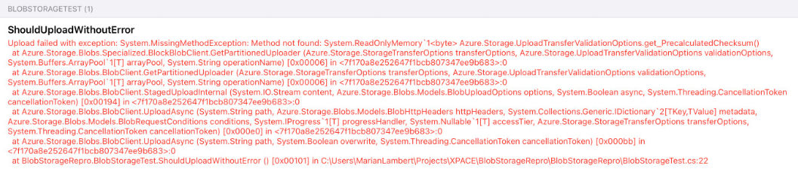

# MRE for [32474](https://github.com/Azure/azure-sdk-for-net/issues/32474)

To reproduce the error follow these steps:
1. Input the connection string and container name in `BlobStorageRepro/BlobStorageTest`
2. Run the tests on an iOS device or simulator
3. You will receive the following error:

